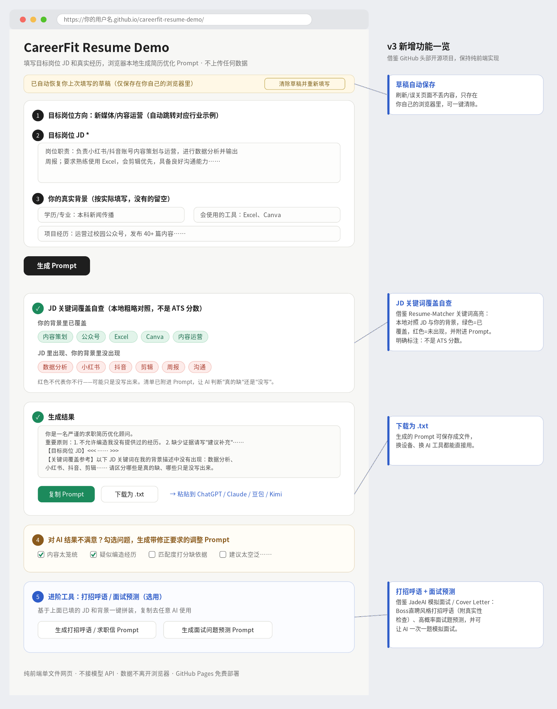
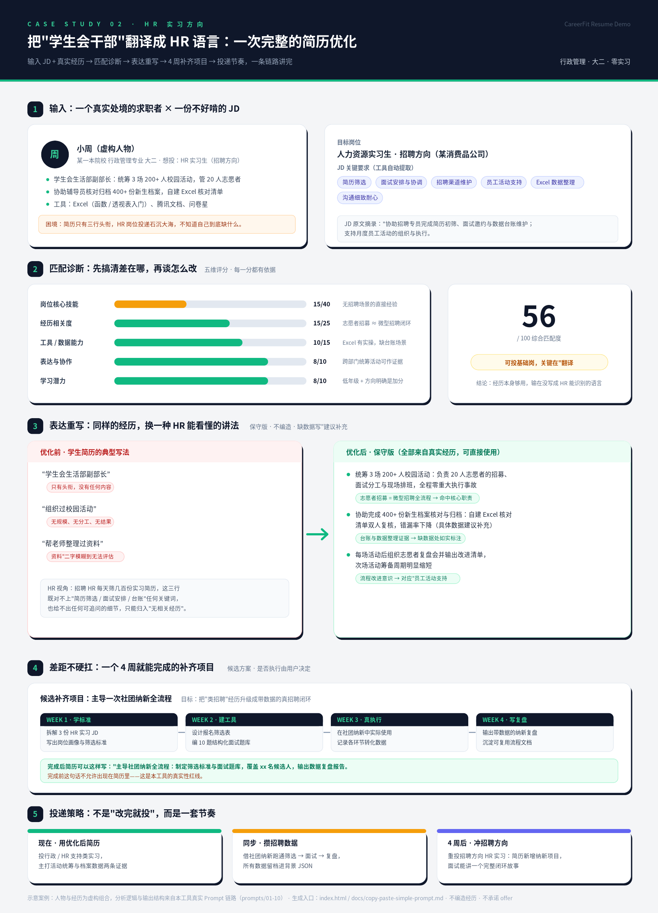

# CareerFit Resume Demo

   

一个面向求职小白的 JD 驱动型简历优化 Prompt 工具包。

用户只需要粘贴目标岗位 JD 和个人真实经历，就可以在 ChatGPT、Claude、豆包、Kimi 等 AI 工具中生成一份结构化求职分析报告：先看懂岗位要求，再挖掘个人履历，最后输出可用于简历的优化表达和单独的求职建议。


## 这个项目能做什么

CareerFit Resume Demo 不是一个泛泛的 Prompt 合集，而是一个围绕“JD 分析 -> 履历挖掘 -> 简历优化 -> 求职建议”的小型产品 Demo。

它可以帮助用户完成：

- **看懂 JD**：提取岗位职责、必备技能、加分项、软技能和简历关键词。
- **挖掘履历**：把用户提供的实习、课程项目、社团、内容运营、AI 工具使用等经历，映射到岗位要求。
- **优化简历表达**：输出保守版和增强版简历表达，区分“可以直接写”和“需要补证据后再写”。
- **判断岗位匹配度**：按核心技能、经历相关度、工具能力、表达协作、学习潜力给出评分和依据。
- **给出求职建议**：单独输出是否建议投递、当前短板、相邻岗位、1-3 个月候选补齐项目。
- **控制真实性风险**：明确禁止编造经历，不把“建议做的事”写成“已经做过的事”。
- **标注建议来源**：说明每条关键建议来自 JD、用户履历、优化后简历还是通用求职判断。
- **支持反馈调整**：如果对任意 AI（豆包、千问、DeepSeek、ChatGPT 等）生成的结果不满意，可以把内容和不满意的地方粘回网页表单，生成一份带具体修正要求的调整 Prompt，不需要重新描述一遍需求。
- **JD 关键词覆盖自查**：网页版在生成 Prompt 时本地对照 JD 关键词和你的背景描述，标出"已覆盖/未出现"，并把清单附进 Prompt 让 AI 区分"真的缺"和"没写出来"。不联网、不是 ATS 分数。
- **打招呼语和求职信**：基于真实经历生成 Boss 直聘/实习僧风格打招呼语和邮件求职信，每个版本标注引用了哪条经历，附真实性检查。
- **面试问题预测与模拟面试**：基于 JD 和优化后简历预测高概率面试问题（标注推导来源和风险等级），并可让 AI 一次一题地模拟面试、结束后统一点评。
- **多 JD 对比**：一份背景同时对比 2-3 个 JD，输出匹配度排序（带依据）、投递策略和每个岗位的简历调整点，帮你决定优先投哪个。
- **简历打印页**：把 AI 输出的保守版简历表达粘回网页，本地生成干净排版的打印页面，用浏览器"打印 → 存为 PDF"导出，零依赖。
- **背景 JSON 导出/导入**：把填好的个人背景保存成本地文件，换设备导入即恢复，相当于你的"主简历数据"。
- **本地输出质检器**：不同 AI 输出质量不稳定——把 AI 的输出粘回网页，本地确定性检查章节完整性、评分是否超上限/加总错误、是否出现你没提供过的数字，问题自动勾选并一键生成修正 Prompt。
- **评分锚点与输出自检**：Prompt 内置评分分档锚点（无证据 ≤40%、可迁移证据 40-70%、直接证据 >70%）和输出前自检清单，降低不同模型间的评分波动。
- **示例数据一键填充**：还没准备好 JD 也能先体验完整流程。
- **分步模式（弱 AI 友好）**：主 Prompt 可拆成 3 段短 Prompt 分步发送，免费版 AI（豆包/Kimi 等）不容易漏章节、烂尾；另可按目标 AI 自动附加格式约束。
- **交叉复核**：把 AI-A 的输出生成一份"审查 Prompt"交给 AI-B 挑错（编造/评分虚高/遗漏），模型互查比自查可靠。
- **面试复盘**：面完试记流水账，生成逐题复盘、短板补齐动作和下次面试检查清单（prompts/11）。
- **投递记录看板**：本地记录投了什么岗、走到哪一步，可导出 CSV，数据不上传。

## 为什么做这个项目

很多学生和转方向求职者并不是完全没有经历，而是卡在三个地方：

- 看完 JD 以后，不知道岗位到底在筛什么能力。
- 有课程、社团、内容、实习或 AI 工具使用经历，但不会写成 HR 能看懂的简历语言。
- 用 AI 改简历时，容易出现夸大、编造、把建议写成事实的问题。

所以这个项目把输出拆成两部分：

- **A. 简历优化结果**：只基于真实经历，生成可以进入简历的表达。
- **B. 求职建议**：单独说明能力差距、项目补齐和投递建议，不混进简历正文。

这个拆分是项目的核心设计原则。

## 目标用户

- 想投实习但看不懂 JD 的学生
- 想转向 AI 产品、运营、数据分析等岗位的小白
- 有经历但不会写成简历语言的求职者
- 想用 AI 辅助简历优化，但担心内容被编造的人

## 核心原则

- 不编造经历，只优化真实经历的表达方式。
- 不承诺 offer，只提供求职判断和简历改进参考。
- 先用 Prompt 工具包验证需求，再考虑网页化。
- 每个 Demo 都保留失败案例和迭代记录。

## 输出示例

用户输入：

```text
1. 目标岗位 JD
2. 个人真实经历
```

工具输出：

```text
A. 简历优化结果
- 岗位要求提取
- 履历事项挖掘
- 匹配度判断
- 简历问题诊断
- 保守版简历表达
- 增强版简历表达
- 真实性检查

B. 求职建议
- 是否建议投递
- 更适合的相邻岗位
- 当前能力短板
- 1-3 个月候选补齐项目
- 面试风险提醒
- 信息来源与判断依据
```


上图是输出报告示意图，用来展示用户输入、AI 处理链路、A/B 输出结果和关键边界，不是真实用户简历或真实 AI 对话截图。完整的真实文字示例见 `examples/` 目录下的 8 个行业 Demo。

## 项目完成度

当前版本已经包含：

- 11 个核心 Prompt 模块（含反馈调整、打招呼语/求职信、面试预测、多 JD 对比、面试复盘）
- 1 个小白可直接复制的整合版 Prompt
- 1 个纯前端网页表单版（index.html，v5，不接 API：关键词自查、草稿保存、JSON 导入导出、分步模式、输出质检器、交叉复核、打印页、投递看板等 16 项工具）
- 1 份图文使用手册（docs/user-guide.md）
- 8 个完整行业 Demo，覆盖全部 8 个岗位方向
- 10 份公开 JD 测试记录，覆盖全部 8 个岗位方向
- 5 个 JD 模拟跑通记录
- 评测方法、4 个真实失败案例记录、信息来源说明和分发说明
- MIT License

## 作为作品集展示了什么

这个仓库也用于展示一个 AI 产品 Demo 从 0 到 1 的设计过程：

- **用户洞察**：从“不会写简历”拆解到“看不懂 JD、不会挖掘经历、担心 AI 编造”三个具体问题。
- **Prompt Workflow**：把任务拆成 JD 解析、匹配分析、简历诊断、简历改写、项目建议、求职建议、反馈调整、打招呼语、面试准备、多 JD 对比、面试复盘 11 个模块，形成一个可以迭代的闭环而不是一次性生成。
- **结构化输出**：用表格、评分维度、A/B 分区降低用户理解成本。
- **评测意识**：用公开 JD 测试集、模拟跑通记录、真实失败案例记录效果。
- **产品边界**：明确不编造经历、不承诺 offer、不收集用户隐私。
- **分发思路**：先用 GitHub Prompt 工具包验证需求，再考虑网页表单或 API 版本。

相近项目分析见 `docs/github-competitive-analysis.md`。

## 首批 Demo 方向

1. AI/大模型产品实习
2. 互联网产品/运营
3. 数据分析
4. 新媒体/内容运营
5. 电商运营
6. 市场/品牌营销
7. 金融/商业分析
8. HR/行政/管培生

## 使用方式

### 网页版（推荐）

打开 `index.html`（部署在 GitHub Pages 后可以直接用链接访问），在表单里填 JD 和个人背景，点击"生成 Prompt"，网页会在你的浏览器本地把内容拼进完整 Prompt 模板，点"复制 Prompt"后自己粘贴到 ChatGPT / Claude / 豆包 / Kimi 使用。

纯前端实现，不接任何模型 API，也不上传或保存任何数据，比手动找文件复制粘贴更省事。详见"网页表单版说明"。

### 简单版

适合想直接用纯文本 Prompt、不想用网页的人。

1. 打开 `docs/copy-paste-simple-prompt.md`
2. 复制完整 Prompt
3. 粘贴到 ChatGPT / Claude / 豆包 / Kimi
4. 补充目标岗位 JD 和个人经历
5. 生成简历优化报告

### 完整版

适合想系统优化简历的人。

1. 复制 `templates/personal-background-template.md`，填写个人背景。
2. 粘贴目标岗位 JD。
3. 按顺序使用 `prompts/` 中的 6 个核心 Prompt，对结果不满意时用第 7 个反馈调整 Prompt；投递和面试阶段再用 08（打招呼语/求职信）、09（面试预测）、10（多 JD 对比）、11（面试复盘）。
4. 参考 `examples/` 中的行业 Demo。
5. 根据输出结果优化简历和项目计划。

更多说明见 `QUICKSTART.md`。

## 网页表单版说明

`index.html` 是这个工具包的 v5 形态：一个单文件静态网页，不依赖任何后端和模型 API。

它做的事情很简单：把 `docs/copy-paste-simple-prompt.md` 里那份固定的 Prompt 文本，用 JavaScript 在你的浏览器里拼上你填的 JD 和个人背景，生成结果后你自己复制去 ChatGPT / Claude / 豆包 / Kimi 用。所有数据处理都在浏览器本地完成，服务器不会收到你填的内容。为防止误关页面丢内容，表单草稿会自动保存在你自己浏览器的 localStorage 里（仅本机可见，可一键清除）。

v3 在 v2 基础上新增（均为纯前端实现，借鉴思路见 `docs/github-competitive-analysis.md`）：

- **JD 关键词覆盖自查**：生成 Prompt 时，本地对照 JD 里的英文工具词和常见中文技能词，标出你的背景"已覆盖/未出现"，未出现的关键词清单自动附进 Prompt，让 AI 判断是"真的缺"还是"没写出来"。页面明确标注这是粗略参考，不是 ATS 分数。
- **草稿自动保存**：填写内容自动存在本机浏览器，刷新/误关不丢失，顶部可一键清除。
- **下载为 .txt**：生成的 Prompt 可下载保存，方便换设备使用。
- **第 5 步进阶工具**：基于已填的 JD 和背景，一键生成打招呼语/求职信（08）、面试预测（09）、多 JD 对比（10）、面试复盘（11）四种 Prompt。

v4 继续新增：

- **多 JD 对比**：第 5 步支持粘贴 1-2 个其他岗位 JD（`---` 分隔），一键生成对比 Prompt（对应 `prompts/10`），输出匹配度排序和投递策略。
- **简历打印页（第 6 步）**：把 AI 输出的保守版简历粘回来，本地生成干净排版页面，浏览器"打印 → 存为 PDF"即可导出。
- **背景 JSON 导出/导入**：一键把填好的内容存成本地文件，换设备/浏览器导入即恢复。

v5（当前版本）针对"不同 AI 输出不稳定"继续新增：

- **本地输出质检器**：粘贴任意 AI 的输出，本地确定性检查章节完整性、评分超上限/加总错误、未提供数字（疑似编造）、建议混入简历正文；自动识别主流程/打招呼语/多 JD 对比三种输出类型，问题自动勾选并联动修正 Prompt。
- **分步模式**：主 Prompt 拆成 3 段短 Prompt 分步发送，免费版 AI（豆包/Kimi 等）完成率更高；可按目标 AI 自动附加格式约束。
- **交叉复核**：生成审查 Prompt 让另一个 AI 挑错（编造/评分虚高/遗漏），模型互查比自查可靠。
- **评分锚点 + 输出自检清单**：Prompt 内置分档锚点与 5 项自检，降低跨模型评分方差。
- **面试复盘（第 5 步）+ 投递记录看板（第 7 步）**：求职流程向后延伸，投递数据本地保存、可导出 CSV。
- **示例数据一键填充**：零门槛体验完整流程。



上图为网页版功能示意图（非真实浏览器截图），展示核心使用流程和新增功能的位置。完整操作说明见 `docs/user-guide.md`，功能全景清单见 `docs/features.md`。

两个完整优化案例（虚构人物，真实链路：输入 → 匹配诊断 → 表达重写 → 4 周补齐项目 → 投递策略）：




做这个的原因：纯文本 Prompt 需要先找到文件、再手动把 JD 和经历分别填进模板空白处，门槛偏高；网页表单把这一步简化成"填表单 + 点按钮"，同时仍然坚持不接 API、不产生成本、不碰用户隐私的原则。

网页第 4 步是"反馈调整"功能：用户不管用的是哪个 AI，只要把生成结果和不满意的地方（勾选或自己描述）贴回来，网页会结合上面已经填好的 JD 和背景，生成一份带具体修正指令的调整 Prompt，用户复制回原对话或新对话继续用，不需要重新描述一遍背景。这个功能同样是纯前端模板拼装，没有接入任何模型 API 去"理解"用户的不满，问题类型是用户自己勾选的，工具只负责把勾选翻译成结构化的修正要求。对应的 Prompt 设计文档见 `prompts/07-feedback-refine.md`。

部署到 GitHub Pages（免费）：

1. 仓库发布到 GitHub 后，进入 `Settings -> Pages`。
2. `Source` 选择 `Deploy from a branch`，分支选 `main`，目录选 `/ (root)`。
3. 保存后几分钟内会生成一个 `https://你的用户名.github.io/仓库名/` 的访问链接。
4. 把这个链接分享出去，任何人点开都能直接填表单，不需要下载或懂代码。

本地也可以直接双击打开 `index.html` 预览效果，不需要任何安装或构建步骤。

## 仓库结构

```text
careerfit-resume-demo/
├── LICENSE
├── README.md
├── QUICKSTART.md
├── index.html
├── roadmap.md
├── assets/
│   ├── careerfit-effect.png
│   ├── careerfit-output-example.png
│   ├── careerfit-output-example.svg
│   ├── careerfit-webform-v3.png
│   ├── careerfit-webform-v3.svg
│   ├── careerfit-case-hr.png
│   └── careerfit-case-pm.png
├── docs/
│   ├── product-brief.md
│   ├── evaluation-method.md
│   ├── failure-cases.md
│   ├── copy-paste-simple-prompt.md
│   ├── github-competitive-analysis.md
│   ├── jd-test-set.md
│   ├── simulation-5-jds.md
│   ├── user-guide.md
│   └── features.md
├── examples/
│   ├── README.md
│   ├── ai-product-intern.md
│   ├── data-analyst.md
│   ├── content-ops.md
│   ├── internet-product-ops.md
│   ├── ecommerce-ops.md
│   ├── marketing-branding.md
│   ├── business-analysis.md
│   └── hr-management-trainee.md
├── prompts/
│   ├── README.md
│   ├── 01-jd-parser.md
│   ├── 02-fit-analysis.md
│   ├── 03-resume-diagnosis.md
│   ├── 04-resume-rewrite.md
│   ├── 05-project-suggestion.md
│   ├── 06-career-advice.md
│   ├── 07-feedback-refine.md
│   ├── 08-greeting-cover-letter.md
│   ├── 09-interview-prep.md
│   ├── 10-multi-jd-compare.md
│   └── 11-interview-review.md
└── templates/
    ├── jd-demo-template.md
    └── personal-background-template.md
```

## 当前状态

项目处于 MVP 发布前整理阶段。

已完成：

- 项目定位
- 文件结构
- 首批 8 个岗位方向
- 模板和评测文档骨架
- 11 个核心 Prompt（进阶模块见 prompts/07-11）
- 8 个完整行业 Demo：AI/大模型产品实习、数据分析、新媒体/内容运营、互联网产品/运营、电商运营、市场/品牌营销、金融/商业分析、HR/行政/管培生
- 10 份公开 JD 测试记录，覆盖全部 8 个岗位方向
- 5 个 JD 模拟测试样例
- 4 个真实失败案例记录（docs/failure-cases.md）
- 展示 A/B 输出结构的效果图（assets/careerfit-output-example.png）
- 纯前端网页表单版 index.html（v4，不接模型 API：反馈调整、JD 关键词覆盖自查、草稿自动保存、进阶工具、多 JD 对比、简历打印页、背景 JSON 导入导出）
- 图文使用手册 docs/user-guide.md、功能全景清单 docs/features.md，以及 AI 产品/HR 两个方向的完整优化案例图
- GitHub 相近项目分析（含 2026-07 头部项目复查更新）
- MIT License

下一步：

- 把仓库发布到 GitHub 并开启 GitHub Pages，拿到 index.html 的正式访问链接
- 根据真实反馈继续校正 Demo 的语气和真实性
- 收集真实使用反馈，持续迭代 Prompt 和 Demo
